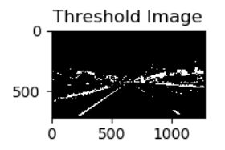
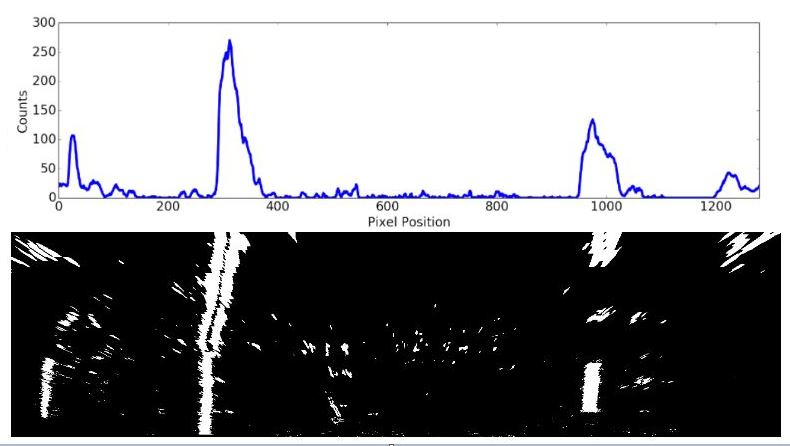

## Advanced Lane Datection

## Project goal

* To develop a software pipeline to identify the lane boundaries amidst challenging conditions (like shades of road color, bending roads etc.).

---

### 1. Pipeline.

The pipeline used for this project is described below:

A class is defined for left and right lanes to store their properties such as best fit, lane dectected?(True or False) etc. 

1. First the camera calibration matrix is computed and distortion coefficients are determined using a given a set of chessboard images.
   
2. Distortion correction matrix is applied to incoming raw images from video.

   
3. Individual Color thresholding ( based on S and H channels in HLS space, R channel in RGB space) is peformed on the undistorted image.
   
4. Sobel X gradient thresholding performed on the undistorted image.

   
5. Resultant image based on outputs in step 3 & in step 4 (series of AND or OR operations as shown below) is obtained.
```python
combined_binary[((r_binary ==1))| (sxbinary == 1)] = 1
combined_binary[((s_binary == 1) & (r_binary ==1) & (h_binary ==1)) | (sxbinary == 1)] = 1
```

   
6. Region of interest is defined.

   
7. Perspective transform applied on region of interest for a "birds-eye view" of the thresholded binary image. The destination points are defined.
```python
src=np.float32([[580,450],[250,700],[1150,700],[720,450]])
dst=np.float32([[250,0],[250,700],[1150,700],[1150,0]])

```
   
8. a. Initial lane pixels for sliding window approach are detected through histogram of lower half of image. 
   
   
   8.b. A fit is determined using sliding window approach for rest of the image. Curvature of the lane and vehicle position with respect to center are determined. 
   
   
   8.c. Sanity Check Protocol:
      * Check if both left and right lane is detected
      * Check if lanes are parallel (observe distance between left and right lane)
      * Check if lanes are too close or too far.
      
   8.d. If no anamoly detected in the sanity check protocol for the fit estimation, store the lane properties to obtain a best fit for both left and right lanes.
      For the future incoming images, a marginal window search (see figure below) for new lanes pixels will be conducted based on the previously obtained best fits for left and right lanes. 
      Sanity check is conducted again for the obtained fit based on new lane pixels. If it evaluates False, histogram based sliding window approach will be reinvoked, else marginal search will be continued for future frames.
   
9. The detected lane boundaries are projected back onto the original image. The final output includes visual display of the lane boundaries and numerical estimation of lane curvature and vehicle position.
   

  
### 2. Test cases output (videos)
* [Project](https://github.com/ashsiv/Advanced-lane-detection/blob/master/output_project_video.mp4) 
* [Challenge](https://github.com/ashsiv/Advanced-lane-detection/blob/master/output_challenge_video.mp4) 
* [Harder Challenge](https://github.com/ashsiv/Advanced-lane-detection/blob/master/output_harder_challenge_video.mp4) 

### 3. Discussion
* Between project video and challenge video, I have to slightly tune the thresholding as shown below to obtain better results .
```python
combined_binary[((r_binary ==1))| (sxbinary == 1)] = 1  # Challenge video
combined_binary[((s_binary == 1) & (r_binary ==1) & (h_binary ==1)) | (sxbinary == 1)] = 1 # Project video
```
* For harder challenge video, since the roads bend way a lot and it is a two-way lane, I need to be very conservative on the following values so that I dont detect the opposite lane. Since roads curve a lot, histogram based sliding window approach will be carried out by the algorithm predominantly.
```python
margin (decrease)
nwindows (increase)
```
Having a fixed region of interest for roads that curve a lot is not ideal. So I have tried to adapt the region of interest on frame to frame basis by the function below. The function redefines a new src and dst points to fine tune the perspective transform based on the prior fits obtained for previous frame.
```python
def remapsrcdst(left_fitx,ploty,right_fitx):
```
Currently am still working on the harder challenge....
